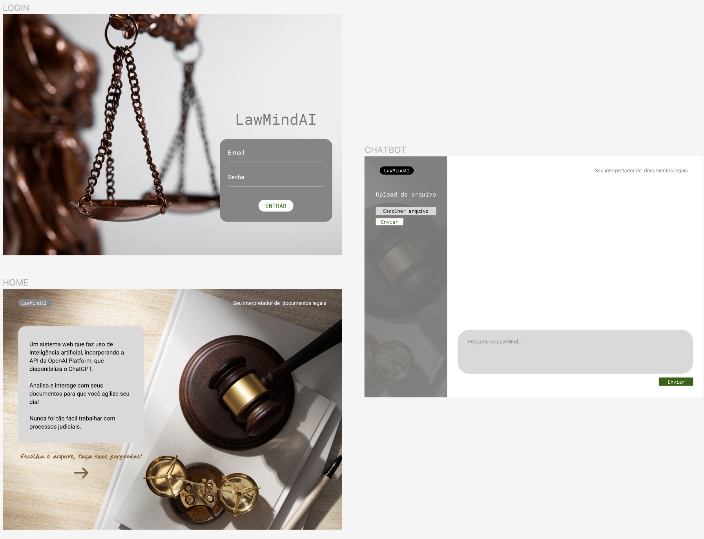

# LawMindAI

LawMindAI é um sistema web que utiliza inteligência artificial para auxiliar na análise e interação com documentos de processos judiciais. Incorporando a API da OpenAI Platform, que disponibiliza o ChatGPT, o sistema permite a interação por meio de perguntas, facilitando a interpretação de documentos legais e agilizando processos. A aplicação foi desenvolvida para ajudar advogados a identificar demandas, desafios, e interagir com conteúdos jurídicos de maneira prática e eficiente.

## Funcionalidades

- **Interação com documentos jurídicos**: O sistema permite anexar documentos em PDF e interagir com eles por meio de perguntas sobre o conteúdo, facilitando a compreensão e análise.
- **Perguntas gerais sobre leis e dúvidas jurídicas**: O chatbot pode responder a perguntas gerais sobre leis e esclarecer dúvidas comuns, como em uma réplica de ação.
- **Análise e identificação de demandas**: A IA ajuda a identificar os principais desafios e demandas enfrentadas pelos advogados ao lidar com processos judiciais.
- **Interface amigável e intuitiva**: A interface foi projetada para ser atraente e fácil de usar, utilizando HTML e CSS para uma experiência agradável.

## Tecnologias Utilizadas

- **Python**: Linguagem de programação usada para implementar a lógica do sistema e integrar a API da OpenAI.
- **OpenAI Platform**: API que oferece o modelo de linguagem ChatGPT para interagir com os usuários.
- **HTML/CSS**: Tecnologias utilizadas para criar a interface gráfica e proporcionar uma experiência de usuário agradável.
- **PDF.js**: Biblioteca JavaScript para visualização e interação com arquivos PDF no navegador.

## Como Usar

1. Clone o repositório:
    git clone https://github.com/seu-usuario/LawMindAI.git

2. Instale as dependências:
    cd LawMindAI
    pip install -r requirements.txt

3. Execute a aplicação:
    python app.py

